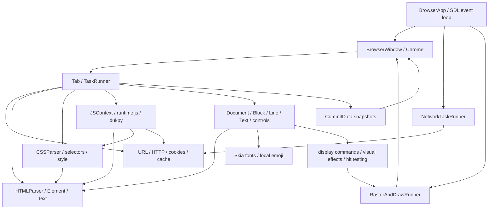

# Browser C17 架構

## 來源與分析邊界

Python oracle 是 `/home/paulboul/tai_gar` 的目前工作樹，不是 tai_ci 的舊 C CLI。
`tests/reference/manifest.json` 記錄來源 commit 與實際檔案 SHA-256；工作樹的 browser.py 有未提交修改，故 commit 本身不足以識別規格。
入口為 browser.py（9,862 行）、runtime.js、browser.css；web_server.py 提供測試網站。
server.py 是另一份較舊 Browser，不能取代目前入口。test.md 是人工測試清單，並非自動測試套件。

## 實際 Python dependency graph

## 狀態、資料與事件

BrowserApp 共享 visited URLs、bookmarks、network/raster runners 與 windows。每個 Window 擁有 tabs、active tab、Chrome、frame clock、committed snapshots 與 scene epoch。
每個 Tab 擁有 URL/history、navigation generation、DOM、CSS rules、JS context、layout、display list、focus、document/element scroll 與 frame estimator。

Navigation 先增加 generation，網路結果排回 Tab task queue；過期 generation 不可改寫頁面。
HTML parse 後按 DOM 順序收集 external scripts、stylesheets、inline styles；可並行取得資源，但按原始順序處理。
目前不收集 inline script。runtime.js 未提供 Python 所有 timer hooks，實際 bridge 必須逐項驗證。
Style → layout → paint tree → immutable commit → raster → window present。點擊使用 paint order 與 clip/scroll 座標 hit test，再執行 JS event 與預設 navigation/form/focus 行為。

## Thread model

SDL browser thread 負責 native window/input/presentation；每個 Tab 有序列化 Main Thread。
Networking Thread 派發 I/O workers，完成後僅傳送結果，不直接修改 DOM/JS。
CPU raster thread 擁有 raster surfaces；GPU 路徑因 GL context 綁定而由 browser thread raster。
Window lock 保護跨執行緒狀態，generation/scene epoch 拒收 stale results；frame scheduling 使用 monotonic deadlines。

## C 邊界與 ownership 決策

依序建立 core、DOM、CSS、transport、layout/display/raster、JS、scheduler、browser/window。
Document 擁有所有 nodes，node parent 與 layout/JS 對 node 的引用皆 borrowed。Document 銷毀前必須先結束 JS/layout 與 callback 使用；DOM mutation 不可讓 JS handles 懸空。
CSS stylesheet 擁有 selectors/declarations；computed style 擁有字串副本。
Network response 擁有 headers/body；跨 queue 移交時移轉 ownership。取消仍須銷毀 payload。
Display snapshot 必須自足且不可在 raster 執行時修改；不得讓 worker 讀取可變 DOM。
Opaque subsystem handles 隔離內部狀態；內部 DOM model 用共用 header 明訂欄位，以免 subsystem 自行發明結構。

## 必須保留的非標準語意

一般 HTML end-tag 僅 pop 一層；attributes 不解 entities；` ` 是 br/ element。
CSS comments 並未正確支援，會影響後續 rule；同 declaration block 後項覆蓋先項，即使先項 important。
一般 img 無 layout；emoji 僅單字元對應本地 PNG。`--rtl` 是右對齊，並非完整 BiDi。
不能用標準 library 的預設行為默默覆寫這些規格。Memory corruption 不屬於可保留行為；C 以錯誤回傳處理無效輸入，差異記錄於 PORTING_PLAN.md。
