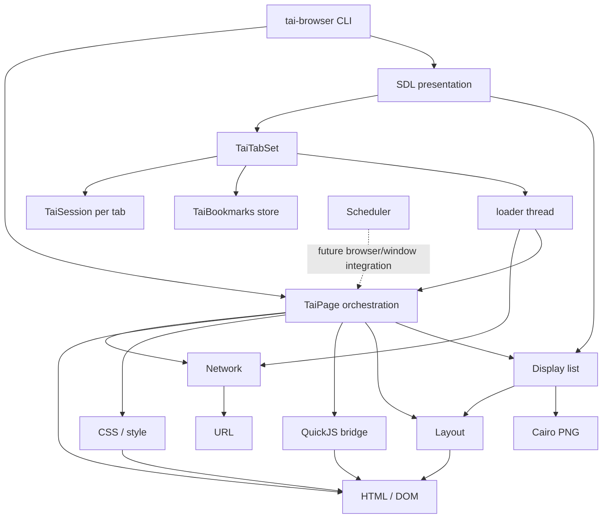

# tai_ci Repository Architecture

本文件是 repository 結構與 subsystem 邊界的入口。先用目錄與 dependency map 定位工作，
再依「Architecture references」的關鍵字只讀取匹配文件；不要預載全部 architecture 文件。

## Repository map

```text
tai_ci/
├── AGENTS.md                  # 共用 agent 契約（每個 session 載入）
├── CLAUDE.md                  # @AGENTS.md 匯入＋Claude Code 專屬設定
├── ARCHITECTURE.md            # 本文件：repo 與 subsystem map
├── PORTING_PLAN.md            # subsystem migration 狀態與差異
├── ACCEPTANCE.md              # 驗收條件與各切片證據索引
├── CMakeLists.txt             # C17 build、dependencies、CTest targets
├── .agents/skills/            # 按需載入的主題規約（Codex 直接掃描）
├── .claude/                   # Claude Code：skills symlink、rules、agents、hooks、settings
├── assets/                    # runtime 靜態資源
├── include/tai/               # public C subsystem interfaces
├── src/                       # native C17 implementation
├── tests/                     # C tests、Python differential、oracle snapshot
│   └── tools/                 # agent 工具：oracle 符號查詢、真實視窗驗證
├── docs/                      # 分析、contract 與漸進式 reference
│   ├── python-{core,render,runtime}.md  # 歷史分析，按需閱讀
│   ├── reference-render-contract.md    # 舊連結導覽
│   ├── reference-{layout-fonts,display-raster,presentation}.md
│   ├── acceptance/            # 各切片的日期化驗證紀錄
│   └── architecture/          # 本文件按 architecture 分支披露的細節
├── deps/                      # ignored/local-only third-party source/sysroot
├── build/                     # ignored/generated normal CMake/Ninja output
└── build-asan/                # ignored/generated ASan/UBSan output
```

`.claude/skills/<name>` 是指向 `.agents/skills/<name>` 的 symlink，兩種 agent 共用同一份內容；
編輯時改 `.agents/skills/`。`.claude/rules/` 依 `paths` 在讀到對應檔案時才載入。
根目錄 `compile_commands.json` 是指向 `build/` 的 ignored symlink，供 clangd 使用。

## Directory responsibilities

| Path | Responsibility | Contents |
|---|---|---|
| `.agents/skills/`, `.claude/` | Agent tooling | On-demand skills, path-scoped rules, subagents, hooks, permissions |
| `assets/` | Browser runtime assets | 預設 user-agent `browser.css`；安裝至 share directory |
| `include/tai/` | Public subsystem contracts | opaque handles、public types、ownership comments、error-return APIs |
| `src/` | Native implementation | 每個 subsystem 的 `.c`、CLI entry point、generated HTML entity table |
| `tests/` | Executable evidence | C unit/integration tests、Python differential drivers、fixtures、reference snapshot |
| `tests/reference/` | Frozen Python oracle | `browser.py`、`runtime.js`、CSS、manifest、reference server 與人工 scenarios |
| `docs/` | On-demand project knowledge | historical Python analysis、topic-specific render contracts、agent rules、architecture details |
| `patches/` | Tracked dependency fixes | configure 時套用至 `deps/` checkout 的 patches；規則見 [`patches/README.md`](patches/README.md) |
| `deps/quickjs/` | JavaScript dependency | QuickJS-NG source integrated by CMake；套用 `patches/quickjs/` |
| `deps/SDL/` | Window/presentation source | vendored SDL3 checkout；CMake 建置並連結靜態 SDL3 |
| `deps/sysroot/` | Local dependency prefix | development headers and libraries such as utf8proc/cmocka |
| `build*/` | Generated artifacts | Ninja files、CTest metadata、libraries、executables；不屬於 source of truth |

## Source layout

Public interfaces generally share a name with their implementation; internal files are listed where they clarify a boundary:

| Interface / implementation | Boundary |
|---|---|
| `core.h` / `core.c` | strings、map、file、JSON primitives |
| `dom.h` / `dom.c` | HTML parsing、document、DOM nodes、view-source |
| `css.h` / `css.c` | CSS parsing、selectors、cascade、computed style |
| `url.h` / `url.c` | URL parsing、resolution、origin and identity |
| `network.h` / `network.c` | libcurl multi requests、responses、cache/cookies |
| `js.h` / `js.c` | QuickJS-NG context、DOM bridge、event dispatch |
| `layout.h` / `layout.c` | block/line/text geometry and font measurement |
| `render.h` / `render.c` | self-contained display list and Cairo PNG raster |
| `presentation.h` / `presentation.c` | SDL3 window lifecycle, event loops and public entry points |
| `presentation_chrome.c` | internal Cairo toolbar, tab strip, buttons and bookmark stars; tab-link hit test |
| `presentation_address.c` | internal address editor, UTF-8 helpers, chrome click and address key/text handling |
| `presentation_scene.c` | internal page/chrome textures, scene composition and scrollbar overlay |
| `presentation_events.c` | internal pointer→pixel mapping and SDL→page event adapter |
| `presentation_internal.h` | internal header shared by the presentation units (`tai_pres_*`); under `src/` |
| `presentation_geometry.h` / `presentation_geometry.c` | internal Chrome/tab geometry and hit boundaries; header is under `src/` |
| `scheduler.h` / `scheduler.c` | priority tasks、generation cancellation、frame deadlines |
| `browser.h` / `browser.c` | `TaiPage` navigation and subsystem orchestration |
| `session.h` / `session.c` | committed page, URL history, address normalization and page commits |
| `tabset.h` / `tabset.c` | ordered window tabs, async load ownership, generation-checked completion, shared bookmarks and `about:bookmarks` page |
| `bookmarks.h` / `bookmarks.c` | sorted bookmark collection, snapshots, atomic per-user file persistence |
| `main.c` | `tai-browser` JSON/screenshot/`--window` CLI |
| `html_entities.inc` | generated named-entity lookup included by `dom.c` |

## Native subsystem map



`tai_core` compiles the page, session, and tab-set subsystems. `tai_presentation`
links the vendored SDL3 library and consumes the same immutable display list as
headless PNG output. The `--window` path starts a tabbed window, routes Chrome
and page input through the active tab, and keeps the SDL event loop responsive
while its loader thread handles document and subresource requests. The older
single-page presentation APIs remain available to callers.

## Test layout

- `test_*.c` mirrors native subsystem boundaries.
- Native tests cover parsing/style/URL, page/session/history/navigation/address,
  display/layout, scheduler/network/JS, and Chrome/tab/window behavior. See
  `CMakeLists.txt` for the current executable and CTest target list.
- `browser_differential.py`, `css_differential.py`, `dom_differential.py`,
  `layout_differential.py`, and `url_differential.py` compare C with the Python
  oracle; `network_integration.py` is registered as the network differential.
- `oracle.py` normalizes Python outputs for comparison.
- `network_fixture.py` and `network_integration.py` provide deterministic localhost HTTP cases.
- `tabs_oracle_probe.py` and `fixtures/tabs_oracle.json` freeze Python tab,
  chrome, delayed-load, resize, and failure behavior; `tabset_integration.py`
  drives native tab-set and SDL-window tests against delayed localhost document
  and CSS responses.
- `bookmarks_oracle_probe.py` and `fixtures/bookmarks_oracle.json` freeze
  Python bookmark toggle, sorting, escaping, and list-link behavior;
  `bookmarks_integration.py` drives `test_tabset_bookmarks.c` against local
  HTTP for shared tabs, exact-URL link GETs, history, and restart persistence;
  `fixtures/bookmarks_window/` serves the real-window check.
- `https_fixture.py` issues a per-run trusted and an untrusted test CA (via the
  `openssl` CLI) and serves 127.0.0.1 HTTP/HTTPS pages; `https_oracle_probe.py`
  and `fixtures/https_oracle.json` freeze Python lock state and address/lock
  geometry; `https_integration.py` drives `test_network --ca`,
  `test_tabset_secure.c`, and `test_tabs_secure_window.c` (whose `--window`
  mode is the real-window harness for HTTPS fixtures).
- `tab_strip_differential.py` measures the live Python chrome for one and two
  tabs across widths and compares `tab_strip_probe.c`'s toolbar row positions,
  which move only when the tab strip actually wraps.
- `url_probe.c` exposes the native URL result to its Python differential driver.
- `fixtures/basic.html` is the current minimal layout input.
- `reference/` stores `browser.py`, `runtime.js`, `browser.css`, `web_server.py`,
  `manifest.json`, `test.md`, and its provenance `README.md`.
- `test_cli.c` runs the screenshot CLI as a subprocess and indirectly covers
  `TaiPage → display list → Cairo PNG` end to end.

## Documentation index

- Historical source analyses (read on demand): [Python core](docs/python-core.md)
  for URL/HTML/CSS, [Python render](docs/python-render.md) for layout/window,
  and [Python runtime](docs/python-runtime.md) for orchestration/JS. For current
  observable behavior, use the frozen oracle and
  [Python reference architecture](docs/architecture/python-reference.md).
- [Rendering contract router](docs/reference-render-contract.md) preserves old
  links; the contracts live in [layout/fonts](docs/reference-layout-fonts.md),
  [display/raster](docs/reference-display-raster.md), and
  [SDL presentation](docs/reference-presentation.md).
- `.agents/skills/` holds the agent rules (oracle, native stack, ownership,
  validation, window verification, workflow, records, oracle lookup).
- `architecture/` contains `python-reference.md`, `native-runtime.md`, and
  `compatibility-semantics.md`.

## Architecture references

Match the current task and concepts encountered. Read every matching document in
full, and leave unmatched branches out of context:

- **Python oracle / BrowserApp / BrowserWindow / Tab / state flow / data flow / event flow / network event / thread model / CommitData / reference graph** → [`docs/architecture/python-reference.md`](docs/architecture/python-reference.md)
- **Native ownership / lifetime / memory safety / use-after-free / dependency direction / TaiDocument / TaiResponse / TaiLayout / TaiDisplayList / Cairo lifecycle / scheduler / task queue / frame clock / runtime CSS** → [`docs/architecture/native-runtime.md`](docs/architecture/native-runtime.md)
- **Compatibility / invalid input / HTML entity / br/ / CSS comment / important / image limitation / emoji / RTL behavior** → [`docs/architecture/compatibility-semantics.md`](docs/architecture/compatibility-semantics.md)
- **Python oracle JSON / font metrics / text measurement / layout rounding / baseline** → [`docs/reference-layout-fonts.md`](docs/reference-layout-fonts.md)
- **Display commands / paint coordinates / Cairo raster / effects / hit test / image / headless PNG screenshot** → [`docs/reference-display-raster.md`](docs/reference-display-raster.md)
- **SDL3 window / tabs / Chrome / resize / event input / scrollbar / native window screenshot** → [`docs/reference-presentation.md`](docs/reference-presentation.md)
- **Migration state / known discrepancy / next subsystem** → [`PORTING_PLAN.md`](PORTING_PLAN.md)
- **Whole-project completion claim** → [`ACCEPTANCE.md`](ACCEPTANCE.md)
