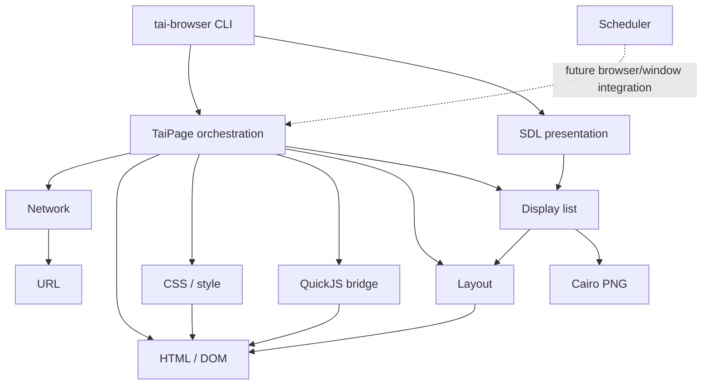

# tai_ci Repository Architecture

本文件是 repository 結構與 subsystem 邊界的入口。先用目錄與 dependency map 定位工作，
再依「Architecture references」的關鍵字只讀取匹配文件；不要預載全部 architecture 文件。

## Repository map

```text
tai_ci/
├── AGENTS.md                  # agent 規約 router
├── ARCHITECTURE.md            # 本文件：repo 與 subsystem map
├── PORTING_PLAN.md            # subsystem migration 狀態與差異
├── ACCEPTANCE.md              # whole-project 驗收條件
├── CMakeLists.txt             # C17 build、dependencies、CTest targets
├── assets/                    # runtime 靜態資源
├── include/tai/               # public C subsystem interfaces
├── src/                       # native C17 implementation
├── tests/                     # C tests、Python differential、oracle snapshot
├── docs/                      # 分析、contract 與漸進式 reference
│   ├── python-{core,render,runtime}.md
│   ├── reference-render-contract.md
│   ├── agents/                # AGENTS.md 按關鍵字披露的工程規約
│   └── architecture/          # 本文件按 architecture 分支披露的細節
├── deps/                      # ignored/local-only third-party source/sysroot
├── build/                     # ignored/generated normal CMake/Ninja output
└── build-asan/                # ignored/generated ASan/UBSan output
```

`.agents/` 與 `.codex/` 是目前為空的 repository-local agent 設定預留目錄；空目錄不由 Git 保存。

## Directory responsibilities

| Path | Responsibility | Contents |
|---|---|---|
| `assets/` | Browser runtime assets | 預設 user-agent `browser.css`；安裝至 share directory |
| `include/tai/` | Public subsystem contracts | opaque handles、public types、ownership comments、error-return APIs |
| `src/` | Native implementation | 每個 subsystem 的 `.c`、CLI entry point、generated HTML entity table |
| `tests/` | Executable evidence | C unit/integration tests、Python differential drivers、fixtures、reference snapshot |
| `tests/reference/` | Frozen Python oracle | `browser.py`、`runtime.js`、CSS、manifest、reference server 與人工 scenarios |
| `docs/` | On-demand project knowledge | Python analysis、render contract、agent rules、architecture details |
| `deps/quickjs/` | JavaScript dependency | QuickJS-NG source integrated by CMake |
| `deps/SDL/` | Window/presentation source | vendored SDL3 checkout；CMake 建置並連結靜態 SDL3 |
| `deps/sysroot/` | Local dependency prefix | development headers and libraries such as utf8proc/cmocka |
| `build*/` | Generated artifacts | Ninja files、CTest metadata、libraries、executables；不屬於 source of truth |

## Source layout

Public headers and implementations use the same subsystem name:

| Interface / implementation | Boundary |
|---|---|
| `core.h` / `core.c` | strings、map、file、JSON primitives |
| `dom.h` / `dom.c` | HTML parsing、document、DOM nodes、view-source |
| `css.h` / `css.c` | CSS parsing、selectors、cascade、computed style |
| `url.h` / `url.c` | URL parsing、resolution、origin and identity |
| `network.h` / `network.c` | libcurl multi requests、responses、cache/cookies |
| `js.h` / `js.c` | QuickJS-NG context、DOM bridge、event dispatch |
| `layout.h` / `layout.c` | block/line/text geometry and font measurement |
| `render.h` / `render.c` | self-contained display list and Cairo PNG raster |
| `presentation.h` / `presentation.c` | SDL3 window, texture and resize/quit presentation |
| `scheduler.h` / `scheduler.c` | priority tasks、generation cancellation、frame deadlines |
| `browser.h` / `browser.c` | `TaiPage` navigation and subsystem orchestration |
| `main.c` | `tai-browser` JSON/screenshot/`--window` CLI |
| `html_entities.inc` | generated named-entity lookup included by `dom.c` |

Public header index: `browser.h`, `core.h`, `css.h`, `dom.h`, `js.h`,
`layout.h`, `network.h`, `render.h`, `scheduler.h`, and `url.h` under
`include/tai/`，另含 `presentation.h`。

## Native subsystem map



`tai_core` compiles the core native subsystems. `tai_presentation` links the
vendored SDL3 library and consumes the same immutable display list as headless
PNG output. The opt-in `--window` path presents one page and handles resize,
expose and quit; input dispatch remains future work.

## Test layout

- `test_*.c` mirrors native subsystem boundaries.
- `test_browser.c`, `test_cli.c`, `test_core.c`, `test_css.c`, `test_dom.c`,
  `test_js.c`, `test_layout.c`, `test_network.c`, `test_presentation.c`, `test_render.c`,
  `test_scheduler.c`, and `test_url.c` are the native test executables.
- `browser_differential.py`, `css_differential.py`, `dom_differential.py`,
  `layout_differential.py`, and `url_differential.py` compare C with the Python
  oracle; `network_integration.py` is registered as the network differential.
- `oracle.py` normalizes Python outputs for comparison.
- `network_fixture.py` and `network_integration.py` provide deterministic localhost HTTP cases.
- `url_probe.c` exposes the native URL result to its Python differential driver.
- `fixtures/basic.html` is the current minimal layout input.
- `reference/` stores `browser.py`, `runtime.js`, `browser.css`, `web_server.py`,
  `manifest.json`, `test.md`, and its provenance `README.md`.
- `test_cli.c` runs the screenshot CLI as a subprocess and indirectly covers
  `TaiPage → display list → Cairo PNG` end to end.

## Documentation index

- `python-core.md`, `python-render.md`, and `python-runtime.md` preserve focused
  analysis of the reference implementation.
- `reference-render-contract.md` owns observable layout, font, display-list, and
  screenshot contracts.
- `agents/` contains `oracle-and-porting.md`, `native-stack.md`,
  `architecture-and-ownership.md`, `validation-and-completion.md`,
  `execution-workflow.md`, and `project-records.md`.
- `architecture/` contains `python-reference.md`, `native-runtime.md`, and
  `compatibility-semantics.md`.

## Architecture references

Match the current task and concepts encountered. Read every matching document in
full, and leave unmatched branches out of context:

- **Python oracle / BrowserApp / BrowserWindow / Tab / state flow / data flow / event flow / network event / thread model / CommitData / reference graph** → [`docs/architecture/python-reference.md`](docs/architecture/python-reference.md)
- **Native ownership / lifetime / memory safety / use-after-free / dependency direction / TaiDocument / TaiResponse / TaiLayout / TaiDisplayList / Cairo lifecycle / scheduler / task queue / frame clock / runtime CSS** → [`docs/architecture/native-runtime.md`](docs/architecture/native-runtime.md)
- **Compatibility / invalid input / HTML entity / br/ / CSS comment / important / image limitation / emoji / RTL behavior** → [`docs/architecture/compatibility-semantics.md`](docs/architecture/compatibility-semantics.md)
- **Rendering geometry / font metrics / text measurement / rounding / baseline / display command / raster / PNG / screenshot contract** → [`docs/reference-render-contract.md`](docs/reference-render-contract.md)
- **Migration state / known discrepancy / next subsystem** → [`PORTING_PLAN.md`](PORTING_PLAN.md)
- **Whole-project completion claim** → [`ACCEPTANCE.md`](ACCEPTANCE.md)
