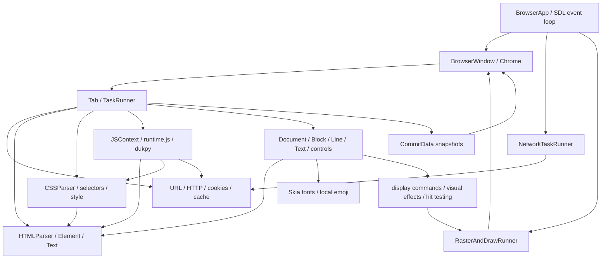

# Python Reference Architecture

## Source boundary

The executable oracle used by this repository is the frozen snapshot under
`tests/reference/`, not the old C CLI. That snapshot comes from the
`/home/paulboul/tai_gar` worktree. `tests/reference/manifest.json` records its
source commit and file SHA-256 values because uncommitted `browser.py` changes
mean the commit alone does not identify the specification.

`tests/oracle.py` imports the snapshot's `browser.py`; `runtime.js` and
`browser.css` are its runtime inputs, and `web_server.py` supplies deterministic
test pages. `server.py` in the source worktree is an older browser and is not
the oracle. `test.md` is a manual scenario list rather than an automated suite.

## Dependency graph

## State and event flow

`BrowserApp` shares visited URLs, bookmarks, network/raster runners, and
windows. Each window owns tabs, its active tab, Chrome, frame clock, committed
snapshots, and scene epoch. Each tab owns URL/history, navigation generation,
DOM, CSS rules, JavaScript context, layout, display list, focus, document and
element scroll, and its frame estimator.

### Window and tab contract

The frozen Python oracle stores tabs in an ordered `BrowserWindow.tabs` list and
tracks the selected object separately as `active_tab`. `new_tab(url)` creates a
new `Tab` at the current window width and page height, passes it the app-shared
visited-URL and bookmark collections, appends it, starts that tab's dedicated
`TaskRunner` thread, selects it, and queues its first load
([`browser.py`: `BrowserWindow.new_tab`, lines 7751–7769](../../tests/reference/browser.py#L7751)).
Each `Tab` has its own URL, history and history index, scroll position, DOM,
document/layout, CSS rules, JavaScript context, display list, frame estimator,
and task runner ([`Tab.__init__`, lines 5700–5742](../../tests/reference/browser.py#L5700)).
Visited URLs and bookmarks are shared through `BrowserApp`; they are not
per-tab state.

Closing a window snapshots its tabs, asks every tab task runner to quit, joins
each runner, then discards that window's raster work and destroys its native
window ([`BrowserWindow.close`, lines 7601–7645](../../tests/reference/browser.py#L7601)).
The Chrome tab row contains a New Tab button and numbered tab links; it defines
no per-tab close button ([`Chrome.chrome_html`, lines 5363–5405](../../tests/reference/browser.py#L5363)).

### Navigation, history, and failed loads

`BrowserWindow.schedule_load` resolves an omitted target to the active tab and
queues `Tab.load` on that tab's runner. New tabs pass their own `Tab` explicitly,
so the queued load stays associated with its creator even if another tab becomes
active ([`schedule_load` and `new_tab`, lines 7724–7769](../../tests/reference/browser.py#L7724)).
At the start of `Tab.load`, Python increments that tab's
`navigation_generation`, discards its previous JavaScript context, assigns the
requested URL, resets document scroll to zero, marks the URL visited, and—when
adding history—truncates the forward branch and appends the URL before starting
network I/O ([`Tab.load`, lines 6067–6092](../../tests/reference/browser.py#L6067)).
Back and Forward move that tab's history index first, then navigate to the
selected entry without appending another one ([`Tab.go_back`/`go_forward`, lines
6144–6159](../../tests/reference/browser.py#L6144)).

Document requests run asynchronously. Their completion is queued back to the
originating tab's task runner, and `_finish_document_load` ignores a result
whose generation no longer matches that tab. Subresource-batch completion has
the same generation check ([`Tab.load`, lines 6114–6135](../../tests/reference/browser.py#L6114),
[`_finish_document_load`, lines 6005–6014](../../tests/reference/browser.py#L6005),
[`_finish_page_resources`, lines 5913–5923](../../tests/reference/browser.py#L5913)).

For a non-certificate network exception, Python builds and parses a `Network
Error` document containing the requested URL and exception text. Because URL
assignment and history insertion happened before the request, a failed first
load leaves that URL at history index 0, and a failed later navigation leaves
the requested URL in the tab's URL/history and displays the error document;
Python does not roll back to the previous page. An SSL certificate verification
exception instead builds a `Certificate Error` document ([`_finish_document_load`,
lines 6016–6045](../../tests/reference/browser.py#L6016)).

### Chrome tab selection and address draft

Chrome renders the New Tab button and numbered links on its first row. The
active tab is labeled `[Tab N]` in bold black, while other tabs use blue `Tab N`
labels ([`Chrome.chrome_html`, lines 5363–5405](../../tests/reference/browser.py#L5363)).
The New Tab button creates and selects a tab whose first URL is
`https://browser.engineering/`; clicking a valid `Tab N` link selects the tab at
that list index ([`Chrome.click`, lines 5295–5339](../../tests/reference/browser.py#L5295),
[`BrowserWindow.new_tab`, lines 7751–7769](../../tests/reference/browser.py#L7751)).

The address bar displays its draft while focused or dirty; otherwise it displays
the active tab's URL. On first focus, a clean draft is initialized from that
URL. Typing or deleting text marks the draft dirty. Chrome clears the draft,
cursor, focus, and dirty flag before handling New Tab, Back, Forward, or a valid
tab-link click ([`Chrome.address_bar_display_text`/`click`, lines 5201–5215 and
5290–5341](../../tests/reference/browser.py#L5201); [`keypress`/`backspace`, lines
5580–5635](../../tests/reference/browser.py#L5580)). Pressing Enter schedules
the address navigation on the active tab and clears the draft afterward
([`Chrome.enter`, lines 5601–5618](../../tests/reference/browser.py#L5601)).

### Resize behavior

For a changed window size greater than 10 pixels in each dimension,
`BrowserWindow.resize` updates window dimensions, rerenders Chrome, computes the
page height from the new Chrome height, and queues a resize for every tab,
including inactive tabs ([`BrowserWindow.resize`, lines 8515–8540](../../tests/reference/browser.py#L8515)).
Each `Tab.resize` accepts widths and page heights greater than 10, updates its
dimensions, and marks an existing document for render ([`Tab.resize`, lines
6829–6841](../../tests/reference/browser.py#L6829)). A resize-triggered relayout
does not itself clamp the current document scroll; if rendering consumes a
pending fragment, that separate path can reposition it. A direct oracle probe
with 20 short paragraphs, a 100-pixel viewport, and `scroll=50` then resized to
a 10,000-pixel viewport produced a new max scroll of 0 while both `tab.scroll`
and committed `CommitData.scroll` remained 50.0 (the document extent including
vertical margins was 436.0000119 pixels in that run). The ordinary explicit
`scroll_by` path clamps scroll to the current document/viewport range
([`Tab.render`/`relayout`, lines 6306–6332](../../tests/reference/browser.py#L6306),
[`run_animation_frame`, lines 6234–6264](../../tests/reference/browser.py#L6234),
[`scroll_by`, lines 6436–6449](../../tests/reference/browser.py#L6436)).

Navigation increments the generation before work begins. Network results return
through the tab task queue; stale generations cannot mutate page state.
Resources are discovered in DOM order. Fetching may overlap, but external and
inline scripts/styles are processed in source order, with scripts sharing one
JavaScript context. The native bridge must validate timer hooks individually
because `runtime.js` does not expose every Python hook yet.

The visual path is style → layout → paint tree → immutable commit → raster →
window presentation. Hit testing follows paint order and clip/scroll
coordinates before JavaScript dispatch and default navigation, form, or focus
behavior.

## Thread model

The SDL browser thread owns native windows, input, and presentation. Each tab
has a serialized main thread. The networking thread dispatches I/O work and
returns results without touching DOM or JavaScript state. The CPU raster thread
owns raster surfaces; the GPU path rasterizes on the browser thread because the
GL context is thread-bound. Window locks protect shared state, generation and
scene epoch reject stale results, and frame scheduling uses monotonic deadlines.
