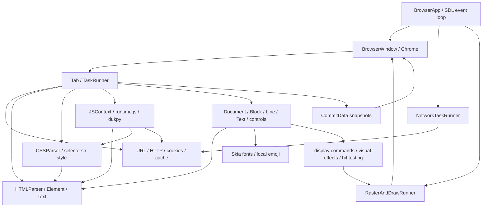

# Python Reference Architecture

## Source boundary

The executable oracle used by this repository is the frozen snapshot under
`tests/reference/`, not the old C CLI. That snapshot comes from the
`/home/paulboul/tai_gar` worktree. `tests/reference/manifest.json` records its
source commit and file SHA-256 values because uncommitted `browser.py` changes
mean the commit alone does not identify the specification.

`tests/oracle.py` imports the snapshot's `browser.py`; `runtime.js` and
`browser.css` are its runtime inputs, and `web_server.py` supplies deterministic
test pages. `server.py` in the source worktree is an older browser and is not
the oracle. `test.md` is a manual scenario list rather than an automated suite.

## Dependency graph

## State and event flow

`BrowserApp` shares visited URLs, bookmarks, network/raster runners, and
windows. Each window owns tabs, its active tab, Chrome, frame clock, committed
snapshots, and scene epoch. Each tab owns URL/history, navigation generation,
DOM, CSS rules, JavaScript context, layout, display list, focus, document and
element scroll, and its frame estimator.

Navigation increments the generation before work begins. Network results return
through the tab task queue; stale generations cannot mutate page state.
Resources are discovered in DOM order. Fetching may overlap, but external and
inline scripts/styles are processed in source order, with scripts sharing one
JavaScript context. The native bridge must validate timer hooks individually
because `runtime.js` does not expose every Python hook yet.

The visual path is style → layout → paint tree → immutable commit → raster →
window presentation. Hit testing follows paint order and clip/scroll
coordinates before JavaScript dispatch and default navigation, form, or focus
behavior.

## Thread model

The SDL browser thread owns native windows, input, and presentation. Each tab
has a serialized main thread. The networking thread dispatches I/O work and
returns results without touching DOM or JavaScript state. The CPU raster thread
owns raster surfaces; the GPU path rasterizes on the browser thread because the
GL context is thread-bound. Window locks protect shared state, generation and
scene epoch reject stale results, and frame scheduling uses monotonic deadlines.
